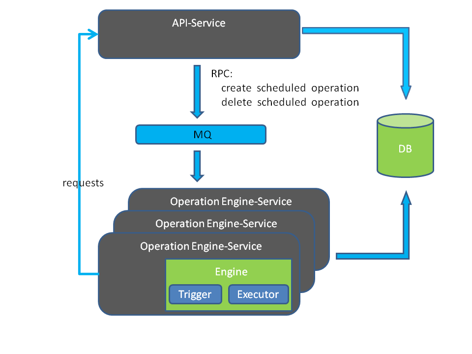
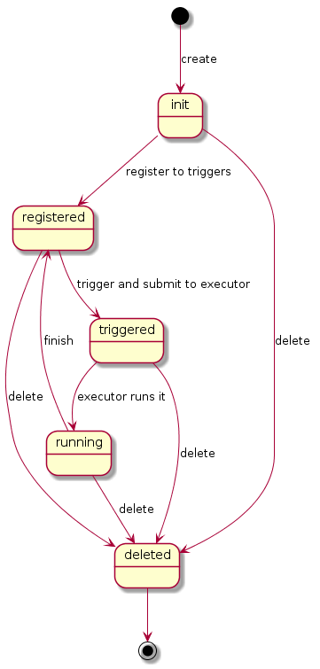
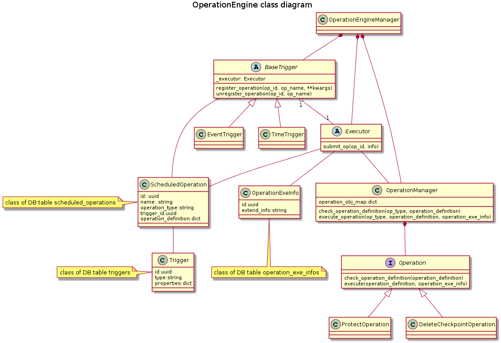
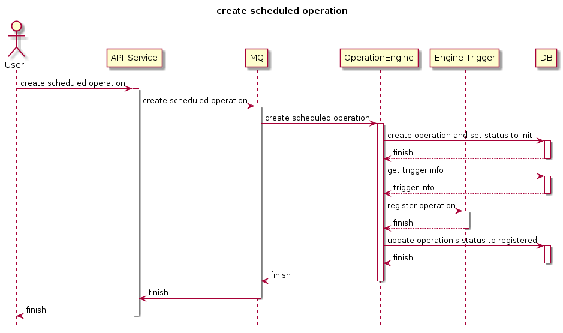
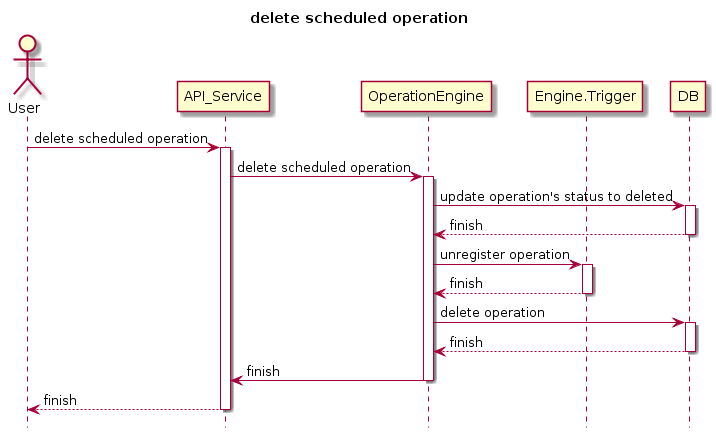

 This work is licensed under a Creative Commons Attribution 3.0 Unported
 License.

 http://creativecommons.org/licenses/by/3.0/legalcode

================
Operation Engine
================

https://blueprints.launchpad.net/karbor/+spec/operation-engine-design

Operation Engine is one of components in Karbor, which is responsible for
triggering the operations to execute when the time is up or event happens.

Problem description
===================
1. Define the operations and triggers (time or event)
2. Bind the operation with trigger and activate the trigger
3. Define the executor which will run the operations
4. Ensure the high availability of Operation Engine Service

Use Cases
---------
1. CRUD operations and triggers

Proposed Change
===============

Data model impact
-----------------
There are 5 relevant tables in the DB.

1. triggers
2. services
3. scheduled_operations
   These three tables are defined at `https://blueprints.launchpad.net/openstack/?searchtext=api-service-design`.
   Please see the bp to get the details.
4. scheduled_operation_states

+--------------------+--------------+------+-----+---------+----------------+
| Field              | Type         | Null | Key | Default |      Extra     |
+====================+==============+======+=====+=========+================+
| created_at         | datetime     | YES  |     | NULL    |                |
+--------------------+--------------+------+-----+---------+----------------+
| updated_at         | datetime     | YES  |     | NULL    |                |
+--------------------+--------------+------+-----+---------+----------------+
| deleted_at         | datetime     | YES  |     | NULL    |                |
+--------------------+--------------+------+-----+---------+----------------+
| id                 | init(11)     | NO   | PRI | NULL    | auto_increment |
+--------------------+--------------+------+-----+---------+----------------+
| operation_id       | varchar(36)  | NO   |     | NULL    |                |
+--------------------+--------------+------+-----+---------+----------------+
| service_id         | int(11)      | NO   |     | NULL    |                |
+--------------------+--------------+------+-----+---------+----------------+
| state              | varchar(32)  | NO   |     | NULL    | values:        |
|                    |              |      |     |         |                |
|                    |              |      |     |         | - init         |
|                    |              |      |     |         | - registered   |
|                    |              |      |     |         | - triggered    |
|                    |              |      |     |         | - running      |
|                    |              |      |     |         | - deleted      |
|                    |              |      |     |         |                |
+--------------------+--------------+------+-----+---------+----------------+
| deleted            | tinyint(1)   | NO   |     | NULL    |                |
+--------------------+--------------+------+-----+---------+----------------+

FOREIGN KEY(operation_id) REFERENCES scheduled_operations(id)
FOREIGN KEY(service_id)   REFERENCES Services(id)

5. scheduled_operation_logs

+--------------------+--------------+------+-----+---------+--------------------------+
| Field              | Type         | Null | Key | Default |           Extra          |
+====================+==============+======+=====+=========+==========================+
| created_at         | datetime     | YES  |     | NULL    |                          |
+--------------------+--------------+------+-----+---------+--------------------------+
| updated_at         | datetime     | YES  |     | NULL    |                          |
+--------------------+--------------+------+-----+---------+--------------------------+
| deleted_at         | datetime     | YES  |     | NULL    |                          |
+--------------------+--------------+------+-----+---------+--------------------------+
| id                 | int(11)      | NO   | PRI | NULL    | auto_increment           |
+--------------------+--------------+------+-----+---------+--------------------------+
| operation_id       | varchar(36)  | NO   |     | NULL    |                          |
+--------------------+--------------+------+-----+---------+--------------------------+
| expect_start_time  | datetime     | YES  |     | NULL    |                          |
+--------------------+--------------+------+-----+---------+--------------------------+
| triggered_time     | datetime     | YES  |     | NULL    |                          |
+--------------------+--------------+------+-----+---------+--------------------------+
| actual_start_time  | datetime     | YES  |     | NULL    |                          |
+--------------------+--------------+------+-----+---------+--------------------------+
| end_time           | datetime     | YES  |     | NULL    |                          |
+--------------------+--------------+------+-----+---------+--------------------------+
| state              | varchar(32)  | NO   |     | NULL    | values:                  |
|                    |              |      |     |         |                          |
|                    |              |      |     |         |  * in_progress           |
|                    |              |      |     |         |  * success               |
|                    |              |      |     |         |  * failed                |
|                    |              |      |     |         |  * dropped_out_of_window |
|                    |              |      |     |         |                          |
+--------------------+--------------+------+-----+---------+--------------------------+
| extend_info        | Text         | YES  |     | NULL    | execution info           |
+--------------------+--------------+------+-----+---------+--------------------------+
| deleted            | tinyint(1)   | NO   |     | NULL    |                          |
+--------------------+--------------+------+-----+---------+--------------------------+

FOREIGN KEY(operation_id) REFERENCES scheduled_operations(id)

instance:

+---------------------+---------------------+---------------------+-----+----------------------------------+---------------------+---------------------+---------------------+---------------------+------------------+---------------------+---------------------+
| created_at          | updated_at          | deleted_at          | id  | operation_id                     | expect_start_time   | triggered_time      | actual_start_time   | end_time            | status           | extend_info         | deleted             |
+=====================+=====================+=====================+=====+==================================+=====================+=====================+=====================+=====================+==================+=====================+=====================+
| 2016-01-01 01:00:02 | 2016-01-01 01:00:07 | NULL                | 0   | 0354ca9ddcd046b693340d78759fd274 | 2016-01-01 01:00:00 | 2016-01-01 01:00:02 | 2016-01-01 01:00:05 | 2016-01-01 01:00:07 | success          | NULL                | 0                   |
+---------------------+---------------------+---------------------+-----+----------------------------------+---------------------+---------------------+---------------------+---------------------+------------------+---------------------+---------------------+

Class Diagram
-------------

Flow
----

